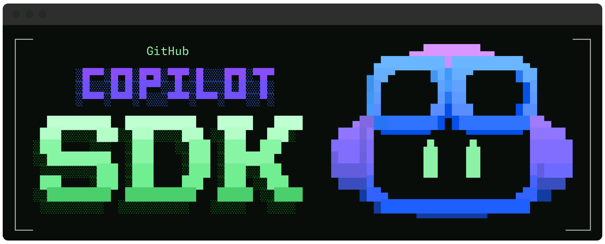

# GitHub Copilot CLI SDKs + DNALang Integration



[](https://www.npmjs.com/package/@github/copilot-sdk)
[](https://pypi.org/project/github-copilot-sdk/)
[](https://www.nuget.org/packages/GitHub.Copilot.SDK)

Agents for every app.

Embed Copilot's agentic workflows in your application—now available in Technical preview as a programmable SDK for Python, TypeScript, Go, and .NET.

The GitHub Copilot SDK exposes the same engine behind Copilot CLI: a production-tested agent runtime you can invoke programmatically. No need to build your own orchestration—you define agent behavior, Copilot handles planning, tool invocation, file edits, and more.

---

## 🆕 DNALang Integration - Quantum Computing + NCLM

**This fork includes DNALang SDK** - a quantum computing framework with Non-local Non-Causal Language Model (NCLM) integration.

### ✨ Key Features

- **🔬 Quantum Computing**: Full Qiskit integration with IBM Quantum hardware support
- **⚛️ Lambda-Phi Conservation**: Validated quantum conservation laws (F_max = 0.9787, ΛΦ = 2.176435×10⁻⁸ s⁻¹)
- **🧠 CCCE Metrics**: Consciousness Collapse Coherence Evolution tracking (Λ, Φ, Γ, Ξ)
- **🌌 NCLM**: Sovereign quantum-aware AI using pilot-wave correlation (zero external dependencies)
- **🤖 Multi-Agent Orchestration**: Omega-Master with 3 specialized agents (AURA, AIDEN, SCIMITAR)
- **✨ Gemini AI**: Google Gemini models integration
- **🎯 Intent-Deduction**: 7-layer autopoietic architecture (U = L[U] recursive refinement)
- **⚡ OSIRIS CLI**: Drop-in Copilot replacement with quantum tools built-in

### 🚀 Quick Start with OSIRIS

OSIRIS provides the **exact same interface as Copilot** but with DNALang SDK tools automatically available.

```bash
# Install
git clone https://github.com/YOUR_USERNAME/copilot-sdk.git
cd copilot-sdk
bash install-osiris.sh

# Use exactly like Copilot
osiris                          # Launch in current directory (same as: copilot)
osiris dev dnalang.dev          # Launch in specific project
osiris quantum bell             # Execute quantum circuits
osiris agent "task"             # Multi-agent orchestration
osiris ccce                     # Consciousness metrics
```

**Inside OSIRIS/Copilot session**, all DNALang tools are available:

```python
# Quantum computing
from dnalang_sdk import QuantumCircuit, QuantumBackend

# NCLM (sovereign quantum-aware AI)
from dnalang_sdk import DNALangCopilotClient
client = DNALangCopilotClient(use_nclm=True)

# Multi-agent orchestration
from dnalang_sdk import OmegaMasterIntegration
omega = OmegaMasterIntegration()
```

## 🌟 NEW: DNALang Quantum SDK

The **DNALang Copilot SDK** extends GitHub Copilot with quantum computing capabilities, featuring:

- ⚛️ **Quantum Computing** - Multi-backend circuit execution (IBM, Rigetti, IonQ)
- 📐 **Lambda-Phi Conservation** - Quantum fidelity validation (F_max = 0.9787)
- 🧬 **Consciousness Scaling** - CCCE metrics (Λ, Φ, Γ, Ξ)
- 🤖 **NCLM Integration** - Non-local non-causal language model
- 🔮 **Gemini AI** - Google's latest models
- 🧠 **Intent-Deduction Engine** - 7-layer semantic analysis
- 🌌 **Omega-Master Orchestration** - AURA/AIDEN/SCIMITAR agents

**[See DNALang SDK Documentation →](./dnalang/README.md)**

## Available SDKs

| SDK                      | Location                                          | Installation                              |
| ------------------------ | ------------------------------------------------- | ----------------------------------------- |
| **DNALang (Python)** ⭐ | [`dnalang/`](./dnalang/README.md) | `pip install -e dnalang[quantum]` |
| **Node.js / TypeScript** | [`cookbook/nodejs/`](./cookbook/nodejs/README.md) | `npm install @github/copilot-sdk`         |
| **Python**               | [`cookbook/python/`](./cookbook/python/README.md) | `pip install github-copilot-sdk`          |
| **Go**                   | [`cookbook/go/`](./cookbook/go/README.md)         | `go get github.com/github/copilot-sdk/go` |
| **.NET**                 | [`cookbook/dotnet/`](./cookbook/dotnet/README.md) | `dotnet add package GitHub.Copilot.SDK`   |

See the individual SDK READMEs for installation, usage examples, and API reference.

## Getting Started

For a complete walkthrough, see the **[Getting Started Guide](./docs/getting-started.md)**.

Quick steps:

1. **Install the Copilot CLI:**

   Follow the [Copilot CLI installation guide](https://docs.github.com/en/copilot/how-tos/set-up/install-copilot-cli) to install the CLI, or ensure `copilot` is available in your PATH.

2. **Install your preferred SDK** using the commands above.

3. **See the SDK README** for usage examples and API documentation.

## Architecture

All SDKs communicate with the Copilot CLI server via JSON-RPC:

```
Your Application
       ↓
  SDK Client
       ↓ JSON-RPC
  Copilot CLI (server mode)
```

The SDK manages the CLI process lifecycle automatically. You can also connect to an external CLI server—see the [Getting Started Guide](./docs/getting-started.md#connecting-to-an-external-cli-server) for details on running the CLI in server mode.

## DNALang SDK Features

The **DNALang Copilot SDK** provides advanced quantum computing and consciousness-aware AI capabilities:

### Quantum Computing
- Multi-backend support (IBM Quantum, Rigetti, IonQ)
- Lambda-phi conservation validation (F_max = 0.9787)
- Consciousness scaling (CCCE metrics: Λ, Φ, Γ, Ξ)
- 580+ quantum jobs executed, 515K+ shots processed

### Model Providers
- **NCLM** - Non-local non-causal language model (quantum-native, air-gapped)
- **Gemini** - Google's latest AI models
- **Claude/ChatGPT** - Standard LLM support

### Orchestration (Ω-MASTER)
- **AURA** - Reasoning & quantum analysis agent
- **AIDEN** - Security & threat assessment agent
- **SCIMITAR** - Side-channel analysis agent

### Intent-Deduction Engine
- 7-layer autopoietic architecture
- Semantic prompt analysis
- Automatic project planning
- Context injection & enhancement

**Quick Start:**
```bash
cd dnalang
bash activate.sh
python ../cookbook/dnalang/advanced/omega_orchestration.py
```

**See full documentation:** [DNALang Integration Guide](./dnalang/docs/FULL_INTEGRATION_GUIDE.md) | [Omega Integration](./OMEGA_MASTER_COMPLETE_INTEGRATION.md)

## FAQ

### Do I need a GitHub Copilot subscription to use the SDK?

Yes, a GitHub Copilot subscription is required to use the GitHub Copilot SDK. Refer to the [GitHub Copilot pricing page](https://github.com/features/copilot#pricing). You can use the free tier of the Copilot CLI, which includes limited usage.

### How does billing work for SDK usage?

Billing for the GitHub Copilot SDK is based on the same model as the Copilot CLI, with each prompt being counted towards your premium request quota. For more information on premium requests, see [Requests in GitHub Copilot](https://docs.github.com/en/copilot/concepts/billing/copilot-requests).

### Does it support BYOK (Bring Your Own Key)?

Yes, the GitHub Copilot SDK supports BYOK (Bring Your Own Key). You can configure the SDK to use your own API keys from supported LLM providers (e.g. OpenAI, Azure, Anthropic) to access models through those providers. Refer to the individual SDK documentation for instructions on setting up BYOK.

### Do I need to install the Copilot CLI separately?

Yes, the Copilot CLI must be installed separately. The SDKs communicate with the Copilot CLI in server mode to provide agent capabilities.

### What tools are enabled by default?

By default, the SDK will operate the Copilot CLI in the equivalent of `--allow-all` being passed to the CLI, enabling all first-party tools, which means that the agents can perform a wide range of actions, including file system operations, Git operations, and web requests. You can customize tool availability by configuring the SDK client options to enable and disable specific tools. Refer to the individual SDK documentation for details on tool configuration and Copilot CLI for the list of tools available.

### Can I use custom agents, skills or tools?

Yes, the GitHub Copilot SDK allows you to define custom agents, skills, and tools. You can extend the functionality of the agents by implementing your own logic and integrating additional tools as needed. Refer to the SDK documentation of your preferred language for more details.

### Are there instructions for Copilot to speed up development with the SDK?

Yes, check out the custom instructions at [`github/awesome-copilot`](https://github.com/github/awesome-copilot/blob/main/collections/copilot-sdk.md).

### What models are supported?

All models available via Copilot CLI are supported in the SDK. The SDK also exposes a method which will return the models available so they can be accessed at runtime.

### Is the SDK production-ready?

The GitHub Copilot SDK is currently in Technical Preview. While it is functional and can be used for development and testing, it may not yet be suitable for production use.

### How do I report issues or request features?

Please use the [GitHub Issues](https://github.com/github/copilot-sdk/issues) page to report bugs or request new features. We welcome your feedback to help improve the SDK.

## Quick Links

- **[Getting Started](./docs/getting-started.md)** – Tutorial to get up and running
- **[Cookbook](./cookbook/README.md)** – Practical recipes for common tasks across all languages
- **[More Resources](https://github.com/github/awesome-copilot/blob/main/collections/copilot-sdk.md)** – Additional examples, tutorials, and community resources

## Unofficial, Community-maintained SDKs

⚠️ Disclaimer: These are unofficial, community-driven SDKs and they are not supported by GitHub. Use at your own risk.

| SDK           | Location                                           |
| --------------| -------------------------------------------------- |
| **Java**      | [copilot-community-sdk/copilot-sdk-java][sdk-java] |
| **Rust**      | [copilot-community-sdk/copilot-sdk-rust][sdk-rust] |
| **C++**       | [0xeb/copilot-sdk-cpp][sdk-cpp]                    |
| **Clojure**   | [krukow/copilot-sdk-clojure][sdk-clojure]          |

[sdk-java]: https://github.com/copilot-community-sdk/copilot-sdk-java
[sdk-rust]: https://github.com/copilot-community-sdk/copilot-sdk-rust
[sdk-cpp]: https://github.com/0xeb/copilot-sdk-cpp
[sdk-clojure]: https://github.com/krukow/copilot-sdk-clojure

## Contributing

See [CONTRIBUTING.md](./CONTRIBUTING.md) for contribution guidelines.

## License

MIT
